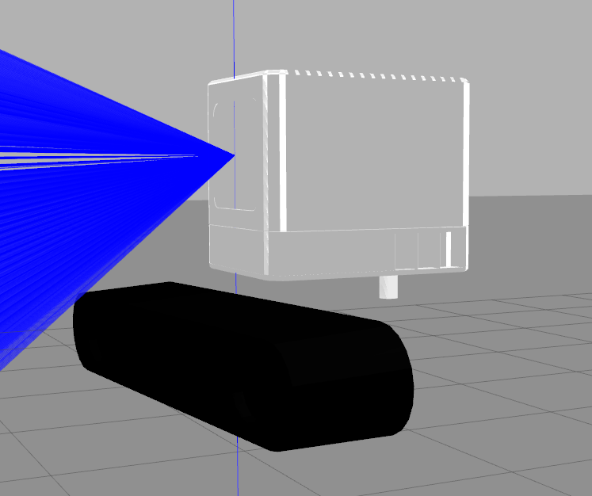
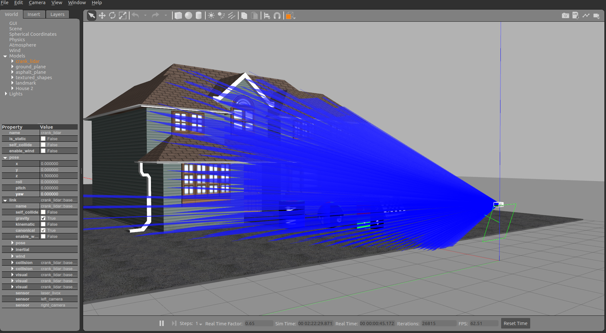
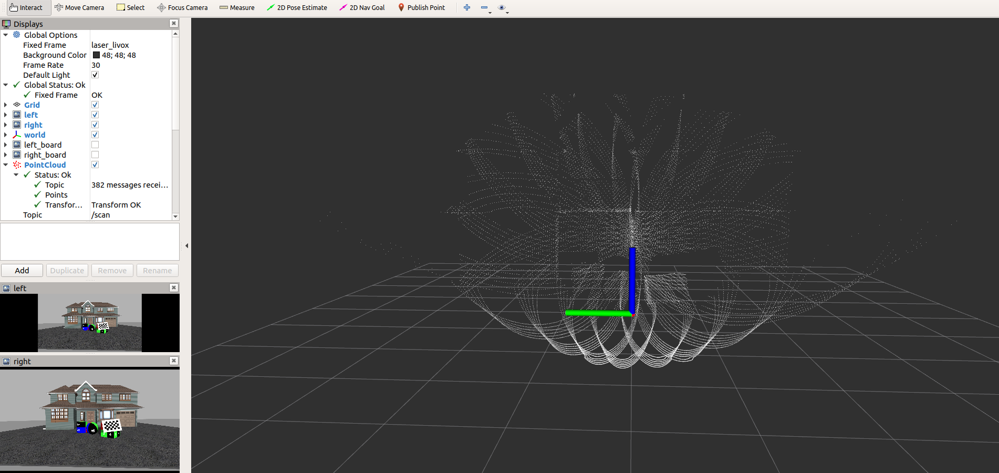
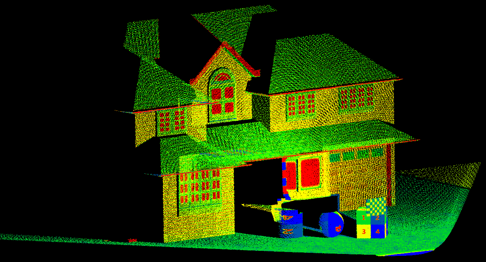

# Livox-LiDAR-Camera System Simulator
A package to provide plug-in for [Livox Series LiDAR](https://www.livoxtech.com). This work is inherited from  [EpsAvlc](https://github.com/EpsAvlc) and LvFengchi's work: [livox_laser_simulation](https://github.com/lvfengchi/livox_laser_simulation.), we would like to thank for their contributions. 

In this repository, we aim to build a tool that can simulate the data acquisition process of a multi-sensor (LiDAR-camera) system.

## Requirements
- ROS(=Kinectic/Melodic)
- Gazebo (= 7.0/9.0)
- OpenCV (>3.0)and 

## Run

- run following command to start a Avia-zed2 system simulator:

  ​	`roslaunch livox_laser_simulation avia_zed2_scence.launch`

  and for MID40:

  ​	`roslaunch livox_laser_simulation mid40_zed2_scence.launch`

  horizon:

  ​	`roslaunch livox_laser_simulation horizon_zed2_scence.launch`

- After the whole gazebo scene is start up, run the data grab tool to save the data.

  ​	`rosrun livox_sim_tool data_recorder`

- further more, if we want to map the laser reflectance intensity on the point clouds  according to the color of the materials, run:

  ​    `rosrun livox_sim_tool intensity_mapping_<****>`, where <****> is the type of calibration board.

- ## Results

- The scan model of Livox LiDAR:

  

- The zed camera combined with Livox LiDAR:

  

- The Gazebo scene:

   

- The rviz visulation :

   

Point clouds with reflectance intensity which mapped according to the color of the materials:

 


## Branchs

### main branch
- enviroment: ROS kinetic + gazebo7
- pointcloud type: 
  - sensor_msg::pointcloud
  - sensor_msg::pointcloud2(pcl::Pointcloud\<pcl::PointXYZ\>)
  - sensor_msg::pointcloud2(pcl::Pointcloud\<pcl::LivoxPointXyzrtl\>)
  - livox_ros_driver::CustomMsg
  <!-- - livox_ros_driver::CustomMsg -->

### gazebo9
- enviroment: ROS melodic + gazebo7
- pointcloud type: sensor_msg::pointcloud2(pcl::Pointcloud\<pcl::PointXYZ\>)

## Dependence

- [livox_ros_driver](https://github.com/Livox-SDK/livox_ros_driver)

## Usage

> If you use gazebo 9, checkout to "gazebo-9-ver" branch. The gazebo-9 version is maintained by [jp-ipu](https://github.com/jp-ipu).

Before you write your urdf file by using this plugin, catkin_make/catkin build is needed.

A simple demo is shown in livox_simulation.launch

Run 
```
    roslauch livox_laser_simulation livox_simulation.launch
```
to see.

Change sensor by change the following lines in the robot.xacro into another xacro file.
```xml
  <xacro:include filename="$(find livox_laser_simulation)/urdf/livox_horizon.xacro"/>
  <Livox_Horizon name="livox" visualize="true" publish_pointcloud_type="2"/>
```

- avia.csv
- horizon.csv
- mid40.csv
- mid70.csv
- tele.csv

## Configuration(example by avia)

- laser_min_range: 0.1  // min detection range

- laser_max_range: 200.0  // max detection range

- horizontal_fov: 70.4   //°

- vertical_fov: 77.2    //°

- ros_topic: scan // topic in ros

- samples: 24000  // number of points in each scan loop

- downsample: 1 // we can increment this para to decrease the consumption

- publish_pointcloud_type: 0 // 0 for sensor_msgs::PointCloud, 1 for sensor_msgs::Pointcloud2(PointXYZ), 2 for sensor_msgs::PointCloud2(LivoxPointXyzrtl) 3 for livox_ros_driver::CustomMsg.

- LiDAR-Camera pose: (set  LiDAR coordinate system as the world system)

  ```
      <arg name="zed2_x" default="0.04"/>
      <arg name="zed2_y" default="0.08"/>
      <arg name="zed2_z" default="-0.061"/>
  
      <arg name="zed2_roll" default="0.015"/>
      <arg name="zed2_pitch" default="0.032"/>
      <arg name="zed2_yaw" default="0.061"/>
  ```


## Simulation for mapping

Currently [Fast-LIO](https://github.com/hku-mars/FAST_LIO) is tested when publish_pointcloud_type = 3。

Enjoy it and feel free to report bugs.
